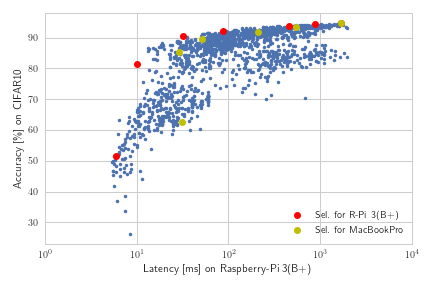
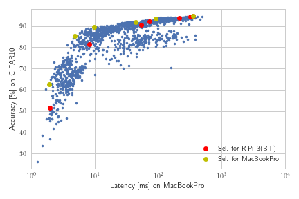

# IoTnets

Networks and inference scripts for PyTorch models used in our PAPER "Constrained deep neural network architecture search
for IoT devices accounting for hardware calibration". This repository contains the main results of the paper. The folder
`networks` contains the source code to represent the architecture search spaces and allows us to sample the exact
network
topologies used in the paper.

## Main features
* Contains all architecture search space definitions
* Contains factory routines to define manual designed subspaces
* Contains factory routines to sample from the defined subspaces
* Contains the configurations to instantiate all network topologies as used in the paper
* Contains all probenets as described in Figure 2 of the following paper: https://arxiv.org/abs/1803.09588
* Contains established, third party models

## Additional features
* Contains three main scripts to use the code
* `main_run_dummy.py`: an example of how to instantiate networks and feed random values
* `main_run_all.py`: allows to characterize a computing platform by instantiating all networks as defined in the
configurations and by measuring the latency for inference
* `main_run_model.py`: allows to load and run trained models, the models need to be downloaded externally (large
files!)

Please, download all models required for `main_run_model.py` here: https://ibm.box.com/s/yo0kpyz9ppjgvkx2z2bfx3lsq5gtgg8l.


We have characterized all trained models on the Raspberry-Pi 3(B+) as explained in our paper. Additionally, we run
the provided code on a MacBook Pro (3.1 GHz Dual-Core i7 equipped with 16 GB 1867 MHz DDR3 memory). The file
`configs/NetConfigs.json` contains all relevant configuration with additional metadata, including the number
of parameters, the number of FLOPs caused for a single batch inference and the obtained accuracy on CIFAR10. Two series
of measurements as presented below are provided in the `results` folder.

Characterization of the trade-off between inference latency and accuracy measured on the Raspberry-Pi 3(B+):




Characterization of the trade-off between inference latency and accuracy measured on the MacBook Pro:



From the following characterization, we observe that the Pareto optimal choices differ between the underlying platforms.
We have identified and provide a set of optimal choices for both cases. The following indices:

```
selPICNets = [687, 611, 450, 405, 306, 349, 64]
selMACCNets = [1552, 1420, 1449, 851, 771, 64]
```

define the highlighted networks by marking the relevant configurations. Those models are Pareto optimal choices covering
 a wide range of latencies.


## Authors and contacts
 - Florian Scheidegger, IBM Research - Zurich, eid@zurich.ibm.com
 - Luca Benini, ETH Zurich
 - Costas Bekas, IBM Research - Zurich
 - Cristiano Malossi, IBM Research - Zurich


## Reference

The full text of our paper "Constrained deep neural network architecture search
for IoT devices accounting for hardware calibration" is available under the following link:
http://papers.nips.cc/paper/8838-constrained-deep-neural-network-architecture-search-for-iot-devices-accounting-for-hardware-calibration.

Please, if you like and use our work, cite our paper as follows:

```
@inproceedings{scheidegger2019constrained,
  title={Constrained deep neural network architecture search for IoT devices accounting for hardware calibration},
  author={Scheidegger, Florian and Benini, Luca and Bekas, Costas and Malossi, A Cristiano I},
  booktitle={Advances in Neural Information Processing Systems},
  pages={6054--6064},
  year={2019}
}
```


## Acknowledgments

This work was funded by the European Union's H2020 research and innovation program under grant
agreement No 732631, project OPRECOMP.

For details visit http://oprecomp.eu/.
